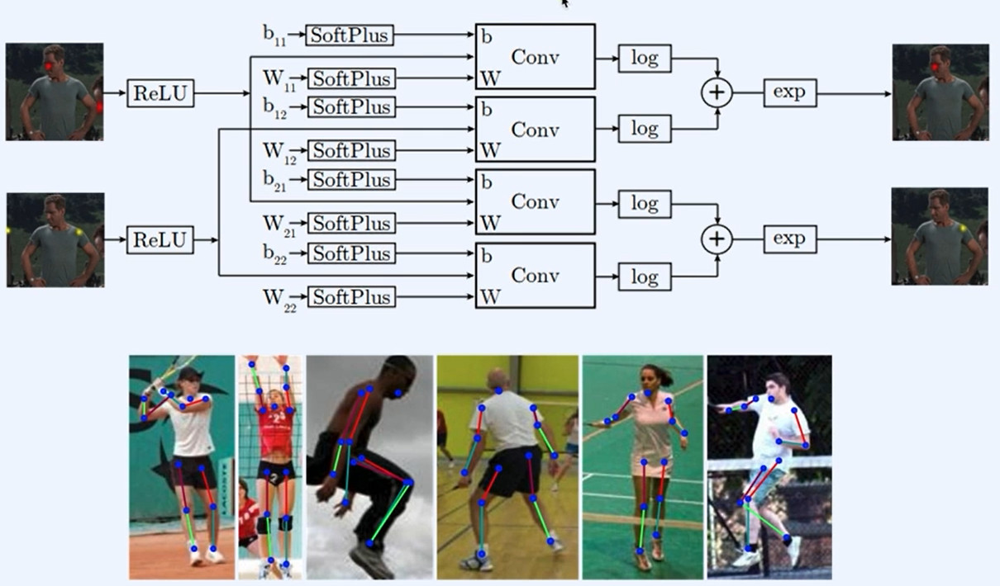
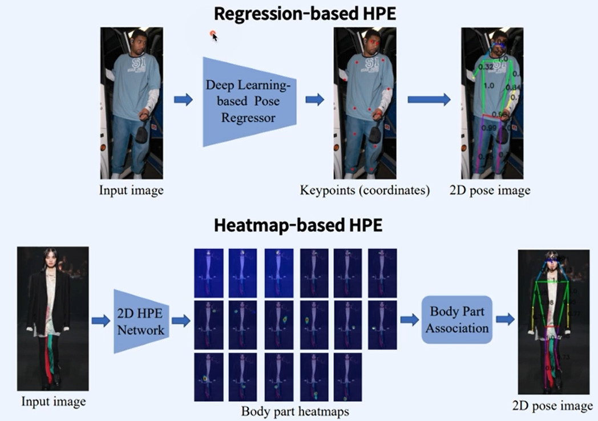
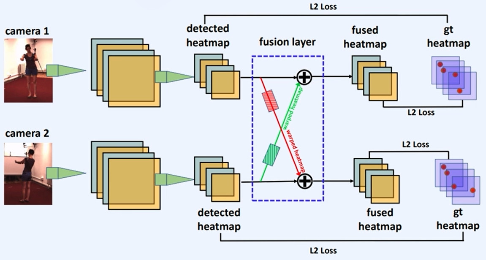
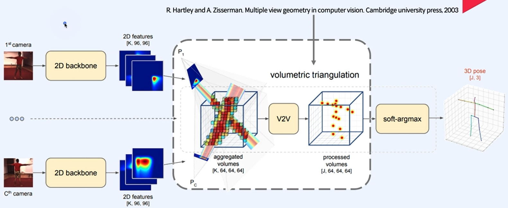
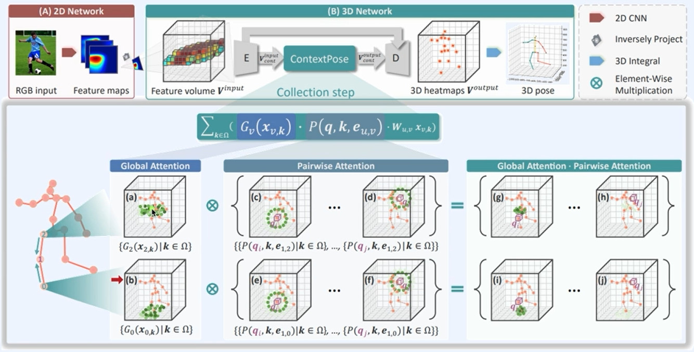

## Human Pose Estimation

Human Motion Understanding (HMU) is a research project that aims to understand human motion.
### Human Pose Estimation
* Human body modeling
    * Kinematic
    * Planar
    * Volumetric: 최근 연구가 진행됨. but, 데이터가 적음

#### **J. Tompson et al. Joint Training of a Convolutional Network and a Graphical Model for Human Pose Estimation. NIPS (2014).** 

* 이미지 입력 시 각 joint 예측을 위해 ConvLayer 사용한 Human Pose Estimation 모델

#### **J. Martinez et al. A simple yet effective baseline for 3d human pose estimation. ICCV (2017).** 

* Human Pose Estimation 모델 중 2D 에서 3D로 넘어가기 위한 기점에 있는 모델
* 2D Human Pose Estimation 값을 받아서 3D로 표현하는 모델

## Locally Connected Layer

#### **H. CI el al. Optimizing Network Structure for 3D Human Pose Estimation. ICCV** 

* Kinematic 형태로 표현하면 tree or graph로 표현 가능한 점을 착안하여 그 구조를 활용한 모델
* 이미지 왼쪽의 FCN를 사용하면 모든 정보가 모두 섞임
* 때문에 GCN으로 그래프 구조를 활용함. But, 모든 노드에 같은 layer GCN을 적용하면 표현력에 제한이 생길 수 있음 따라서 LCN을 사용함
* LCN(Locally Connected Network): 사람 몸을 본뜬 Kinematic은 각 노드별로 update layer를 따로 만들어줘도 부담이 없음을 착안해 node별로 별개의 layer를 사용함

#### C.Zheng et al. Deep Learning-Based Human Pose Estimation: A Survey.

* regression based HPE
* Input 이미지로 keypoint를 만들어 2D pose kinematic을 만들고 이에 더해 3D pose를 예측하는 Regression based HPE

 <b>Heatmap-based HPE</b> 

#### **H. Qiu et al. Cross View Fusion for 3D Human Pose Estimation. ICCV.** 

**Multi-view 2D poses -> 3D pose** 

* 여러 카메라로 찍은 이미지의 feature map을 섞어서 3D pose를 예측하는 모델

#### **K. Iskakov et al. Learnable Triangulation of Human Pose. ICCV** 

* multiview 이미지에 삼각측량법을 사용한 heatmap 검출 3d pose estimation 모델

#### **X. Ma et al. Context Modeling in 3D Human Pose Estimation: A Unified Perspective. CVPR** 

### Context Pose

* 사람과 관련이 없는 keypoint는 낮은 score를 갖도록 하고, 사람과 관련이 있는 keypoint는 높은 score를 갖도록 한 모델
* 사람의 팔 다리 길이는 고정적이기때문에 e_uv를 활용해 평균 분산으로 joint들의 거리를 고정시킴