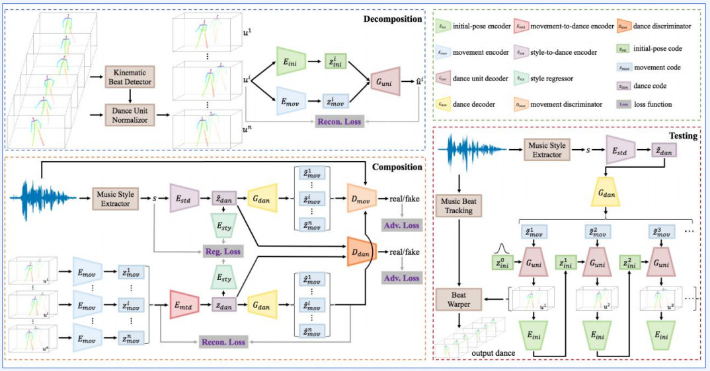

# Human Motion Understanding with Deep Learning

* 참고용 플랫폼
    * [openMMlab](https://platform.openmmlab.com/home/)

## Human Pose Estimation Models

Human Motion Understanding (HMU) is a research project that aims to understand human motion.
### **Human Pose Estimation**
* Human body modeling
    * Kinematic
    * Planar
    * Volumetric: 최근 연구가 진행됨. but, 데이터가 적음
   

#### **J. Tompson et al. Joint Training of a Convolutional Network and a Graphical Model for Human Pose Estimation. NIPS (2014).** 
### 1. Conv-based 2D HPE(Human Pose Estimation) 
* 이미지 입력 시 각 joint 예측을 위해 ConvLayer 사용한 Human Pose Estimation 모델
  

#### **J. Martinez et al. A simple yet effective baseline for 3d human pose estimation. ICCV (2017).** 
### 2. 2D -> 3D HPE(Human Pose Estimation) 
* Human Pose Estimation 모델 중 2D 에서 3D로 넘어가기 위한 기점에 있는 모델
* 2D Human Pose Estimation 값을 받아서 3D로 표현하는 모델
  

#### **H. CI el al. Optimizing Network Structure for 3D Human Pose Estimation. ICCV** 
### 3. Locally Connected Network(LCN) 
* Kinematic 형태로 표현하면 tree or graph로 표현 가능한 점을 착안하여 그 구조를 활용한 모델
* 이미지 왼쪽의 FCN를 사용하면 모든 정보가 모두 섞임
* 때문에 GCN으로 그래프 구조를 활용함. But, 모든 노드에 같은 layer GCN을 적용하면 표현력에 제한이 생길 수 있음 따라서 LCN을 사용함
* LCN(Locally Connected Network): 사람 몸을 본뜬 Kinematic은 각 노드별로 update layer를 따로 만들어줘도 부담이 없음을 착안해 node별로 별개의 layer를 사용함
  

#### **C.Zheng et al. Deep Learning-Based Human Pose Estimation: A Survey.** 
### 4. Deep Learning-Based Human Pose Estimation 
* regression based HPE
* Input 이미지로 keypoint를 만들어 2D pose kinematic을 만들고 이에 더해 3D pose를 예측하는 Regression based HPE 

 <b>Heatmap-based HPE</b> 

  

#### **H. Qiu et al. Cross View Fusion for 3D Human Pose Estimation. ICCV.** 
### 5. Cross View Fusion(CVF) Multi-View 2D poses -> 3D pose 
**Multi-view 2D poses -> 3D pose** 
* 여러 카메라로 찍은 이미지의 feature map을 섞어서 3D pose를 예측하는 모델

  

#### **K. Iskakov et al. Learnable Triangulation of Human Pose. ICCV** 
### 6. Triangulation 
* multiview 이미지에 삼각측량법을 사용한 heatmap 검출 3d pose estimation 모델
  

#### **X. Ma et al. Context Modeling in 3D Human Pose Estimation: A Unified Perspective. CVPR** 
### 7. ContextPose 

* 사람과 관련이 없는 keypoint는 낮은 score를 갖도록 하고, 사람과 관련이 있는 keypoint는 높은 score를 갖도록 한 모델
* 사람의 팔 다리 길이는 고정적이기때문에 e_uv를 활용해 평균 분산으로 joint들의 거리를 고정시킴
  

#### **T. Xu et al. Graph Stacked Hourglass Networks for 3D Human Pose Estimation. CVPR** 
### 8. Graph Hourglass 
  

#### **-C. Zheng et al. Deep Learning-Based Human Pose Estimation: A Survey** 
### 9. Multi-HPE 
* 여러 사람의 pose를 예측하는 모델
* Bottom-up: 사람의 keypoint를 먼저 예측한 후 그 keypoint를 이어주는 방식
* Topdown: 사람을 bounding box로 crop하고 그 사람의 keypoint를 예측하는 방식
  

#### **K. Li et al . Pose Recognition with Cascade Transformers. CVPR** 
### 10. PRTR 
* Transformers 모델 기반의 Multi-Pose Recognition 모델
  
  

  

## Human Motion Application

1. L. Ma et al. Pose Guided Person Image Generation. NIPS  

### Pose Guided Person Image Generation
  

2. S. Yan et al. Spatial Temporal Graph Convolutional Networks for Skeleton-Based Action Recognition. AAAI

### ST-GCN
  

3. A. Markovitz et al. Graph Embedded Pose Clustering for Anomaly Detection. CVPR

### ST-GCAE
  

4. J. Wang et al. AI Coach: Deep Human Pose Estimation and Analysis for Personalized Athletic Training Assistance. ACM MM 

### AI Coach
  

5. C. Patel et al. TAILORNET: PREDICTING CLOTHING IN 3D AS A FUNCTION OF HUMAN POSE, SHAPE AND GARMENT STYLE. CVPR

### TailorNet
* https://virtualhumans.mpi-inf.mpg.de/tailornet/
  
  

6. N. Willett et al. Pose2Pose: Pose Selection and Transfer for 2D Character Animation. IUI

### Pose2Pose
* http://www.norawillett.com/pose2pose/index.html
  

7. C. Weng et al. Photo Wake-Up: 3D Character Animation from a Single Photo. CVPR 

### Photo Wake-Up ★★
* https://grail.cs.washington.edu/projects/wakeup/
  

8. Y. Gu et al. Home-based Physical Therapy with an Interactive Computer Vision System. ICCV Workshop

### Home-based Physical Therapy
  

9. H. Lee et al. Dancing to Music. NeurIPS

### Dancing to Music
* https://github.com/NVlabs/Dancing2Music
  
  
  

10. E. Aksan et al. Structured Prediction Helps 3D Human Motion Modelling. ICCV

### Structured Prediction Helps 3D Human Motion Modelling

* https://ait.ethz.ch/projects/2019/spl/
  
  
  

11. S. Ginosar et al. Learning Individual Styles of Conversational Gesture. CVPR

### Learning Individual Styles of Conversational Gesture
* https://chahuja.com/pats
* http://people.eecs.berkeley.edu/~shiry/speech2gesture/
  

12. C. Chan et al. Everybody Dance Now. ICCV

### Everybody Dance Now
  
  

13. R. Li et al. AI Choreographer: Music Conditioned 3D Dance Generation with AIST++. ICCV 

### AI Choreographer
* https://google.github.io/aistplusplus_dataset/
* https://google.github.io/aichoreographer/
  
  